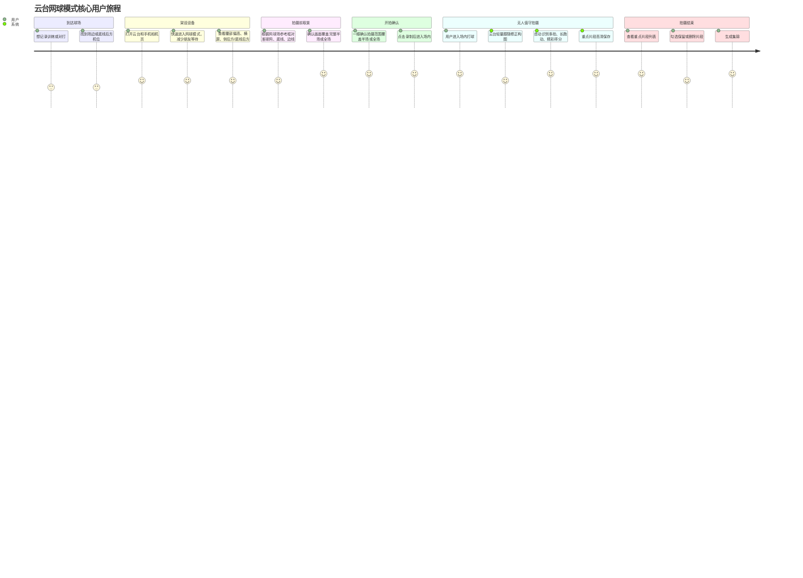
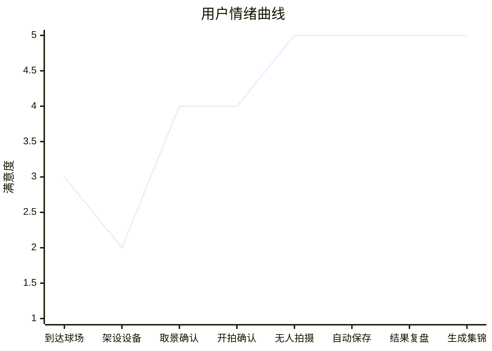

# 云台网球模式用户旅程地图

## 旅程总览

## 分阶段地图

| 阶段 | 用户目标 | 用户行为 | 用户想法/情绪 | 核心痛点 | 产品触点 | 设计机会 |
| --- | --- | --- | --- | --- | --- | --- |
| 1. 到达球场 | 想无人记录训练或对打 | 找场边、底线后方或侧后方位置 | “我想拍到完整回合，但没人帮我看画面” | 不确定机位是否合适 | 模式入口、机位建议 | 明确告诉用户推荐高度、方向、位置 |
| 2. 进入网球模式 | 快速进入专用拍摄能力，减少架设耗时 | 在拍摄页模式栏选择“网球模式”，尽量少调参数 | “朋友在等我，场地费也在烧，最好别让我挑太久” | 调试和模式选择耗时长，会造成朋友等待的尴尬，也浪费昂贵场地时间 | 拍摄页模式切换、默认参数、快速确认入口 | 网球模式应尽量一键进入，默认开启横屏、广构图、自动识别、重点保存，减少用户在模式和参数中反复选择 |
| 3. 拍摄前取景 | 在场上没人时也能完成架机，同时拍得好看 | 根据场地参考框对准球网、底线、边线，并把设备架在腰部偏高一点 | “我不在画面里，只能靠球场线判断；如果机位好看一点，腿会显得更长” | 不能用人物作为构图参照；架太低容易显矮、画面像监控，架太高又可能压缩动作空间 | 网球场参考框、画面提示、机位高度建议 | 用球网/底线/单双打边线做标尺，提示覆盖半场/全场；高度建议从“腰到胸口”细化为“腰部偏高到下胸口”，兼顾覆盖范围和人物比例 |
| 4. 开拍确认 | 范围够了就立刻开拍，减少等待 | 看实时拍摄范围和参考框，确认覆盖完整半场/全场后点击录制 | “我一眼就能看出拍摄范围够不够，别再让我等一个识别过程” | 如果额外出现“识别锁定”等等待，会显得像伪场景，反而增加调试时间和焦虑 | 实时预览、取景参考框、开始录制按钮 | 把算法准备后台化，不把“识别锁定”做成主路径；只有画面明显不可用时再提示手动调整 |
| 5. 无人值守拍摄 | 专心打球，不再看手机 | 用户进入场内训练或对打 | “希望我跑动时别出画” | 横向移动大、发球挥拍容易出画 | 云台自动跟随状态、录制时长、电量、存储 | 采用轻量跟随修正，避免强追导致画面甩动 |
| 6. 自动保存重点片段 | 不想后期翻几十分钟素材 | 系统自动保存多拍、长跑动、精彩得分 | “有价值的片段最好自动留下” | 整场高清保存占空间，后期筛选成本高 | “已自动保存高清片段”提示、保存策略面板 | 重点高清保存，普通低清缓存，无效短期缓存 |
| 7. 拍摄结束复盘 | 快速找到值得保留的内容 | 查看重点片段列表，勾选保留/删除 | “我只想保留真正有用的内容” | 素材过多、不知道哪些值得保留 | 结果页片段列表、推荐理由、节省空间提示 | 每个片段展示类型、时间点、时长、推荐理由 |
| 8. 生成集锦 | 快速产出可分享内容 | 点击生成集锦 | “这场球能不能马上发出去？” | 剪辑门槛高 | 生成集锦按钮 | 将已保留高清片段串成短视频草稿 |

## 情绪曲线

## 关键体验原则

- 拍摄前不要要求用户站进画面，优先使用球场线作为取景参照。
- 架设阶段要尽量缩短调试和模式选择时间，避免朋友等待、场地费浪费带来的压力。
- 调试时用户核心看到的是实时拍摄范围，能一眼确认覆盖是否足够；不要把“识别锁定”包装成主路径等待场景。
- 机位高度建议从“腰到胸口”进一步产品化为“腰部偏高到下胸口”，在不牺牲覆盖范围的前提下让人物比例更好看。
- 网球模式默认横屏和广构图，给横向跑动、发球、挥拍保留空间。
- 云台跟随应偏轻量修正，避免为了追人造成画面频繁甩动。
- 拍摄中减少操作依赖，用户进入场内后默认不需要再手动点选主体。
- 素材策略要突出“重点高清保存，非重点降级处理”，避免整场几十分钟全部高清保存。
